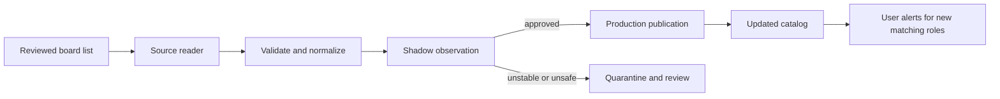

# Greenhouse and Ashby ingestion plan

## Goal

Extend the catalog through reliable, employer-published Greenhouse and Ashby job-board data while preserving the product's direct-to-employer, technical-internship focus. This is an ingestion platform extension, not broad browser scraping and not application automation.

## Plain-language terms

- **Reviewed board list:** InternNotifs' approved list of employer career boards to check.
- **Source reader:** a small provider-specific piece of code that reads public job data and converts it to InternNotifs' common listing format. Code often calls this an *adapter*.
- **Snapshot:** the complete set of roles visible on one board at one point in time.
- **Shadow mode:** checking a source and measuring quality without showing its roles to users.

## Core model

The system maintains a reviewed board list, then applies the same lifecycle to every provider. Greenhouse and Ashby are the first source readers; later providers should follow the same shared rules.

## Reviewed board list

The reviewed board list defines what the product covers. Each board entry includes the employer, provider, public board identifier, expected application domains, polling policy, review state, and a person responsible for it. It also records operational state such as last successful fetch and current health.

There is no authoritative global directory of every Greenhouse or Ashby board. The product should therefore claim coverage of its approved board list—not an unprovable promise to index every employer globally. Discovery can propose boards, but only reviewed boards reach publication.

## Reading each provider

Each source reader consumes the provider's public job-board data and produces a complete board snapshot in the shared listing format. It must:

1. Fetch public published postings without employer credentials, browser automation, or application-submission APIs.
2. Validate the provider response before mapping it into titles, locations, descriptions, identifiers, timestamps, compensation when disclosed, and official application URLs.
3. Classify technical internships, co-ops, and apprenticeships; retain source-declared work mode and eligibility requirements only when clearly present.
4. Emit source health and a safe diagnostic result alongside listings, including a response hash or version signal when available.

The shared rules keep polling, quality checks, duplicate handling, notification behavior, and operational monitoring consistent across providers.

## Admission and publication lifecycle

| State | Purpose | User-visible behavior |
| --- | --- | --- |
| Candidate | A board has been discovered but not vetted | None |
| Shadow | Fetch and measure output without publishing | None |
| Approved | Stable, employer-owned, useful board | Eligible roles enter the catalog |
| Quarantined | Source or data quality is unsafe | Existing roles are protected; new data is withheld |
| Retired | Board is intentionally no longer maintained | Source stops polling after review |

Shadow mode verifies employer ownership, official apply destinations, technical-intern coverage, predictable data, and source health. Promotion should require representative test data and explicit quality rules.

## Updating new, changed, and closed roles

Every successful board response is a current snapshot, rather than merely a list of additions. The update process:

- creates newly seen eligible listings;
- updates materially changed listings while preserving their source history;
- marks that board's record of a role closed when it is absent from a later successful snapshot; and
- closes the catalog role only when no active source still supports it.

This prevents stale roles from remaining open indefinitely while avoiding accidental closure during a failed or quarantined fetch.

## Scale and reliability

Start with frequent polling of the approved board list. As it grows, use a planner that creates one task per board; task runners limit requests per provider, retry temporary failures, and pause a board after repeated failures. One broken board or provider must not consume the entire polling window.

The shared reliability plan supplies source freshness, retry and failed-work handling, alerting, and replay. Key measures are active boards, roles per board, freshness, invalid-link rate, duplicate rate, reader failure rate, and time from employer publication to catalog availability.

## Trust boundaries

Publication gates remain the same for every provider: technical early-career relevance, direct HTTPS application destination, live-link validation, duplicate handling, source history, and checks for bad or unexpectedly changed data. Keep only the evidence needed to debug public job data; never collect applicant data or use credentials intended for employer administration.

## Rollout

1. Define the reviewed-board list and Greenhouse/Ashby source-reader rules with representative test data.
2. Add a small reviewed cohort in shadow mode and validate catalog quality and operational health.
3. Promote stable boards, add role updates/closures, and connect alerts.
4. Scale coverage through the review queue and independent queue-based tasks.

Success means a growing, auditable set of official employer boards that updates quickly, degrades safely, and never creates duplicate, stale, or untrusted catalog entries.
