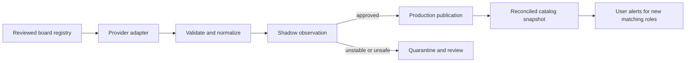

# Greenhouse and Ashby ingestion plan

## Goal

Extend the catalog through reliable, employer-published Greenhouse and Ashby job-board data while preserving the product's direct-to-employer, technical-internship focus. This is an ingestion platform extension, not broad browser scraping and not application automation.

## Core model

The system maintains a reviewed registry of employer boards, then applies the same lifecycle to every provider. Greenhouse and Ashby are the first adapters; later providers should plug into the same contract.

## Board registry

The registry is the coverage boundary and source of truth. A board record includes the employer identity, provider, public board identifier, expected application domains, polling policy, review state, and source owner. It also records operational state such as last successful fetch and current health.

There is no authoritative global directory of every Greenhouse or Ashby board. The product should therefore claim coverage of its approved registry—not an unprovable promise to index every employer globally. Discovery can propose records, but only reviewed records reach publication.

## Provider adapter contract

Each adapter consumes the provider's public job-board data and produces a complete board snapshot in the shared listing format. It must:

1. Fetch public published postings without employer credentials, browser automation, or application-submission APIs.
2. Validate the provider response before mapping it into titles, locations, descriptions, identifiers, timestamps, compensation when disclosed, and official application URLs.
3. Classify technical internships, co-ops, and apprenticeships; retain source-declared work mode and eligibility requirements only when clearly present.
4. Emit source health and a safe diagnostic result alongside listings, including a response hash or version signal when available.

The common contract keeps polling, quality gates, deduplication, notification behavior, and observability out of provider-specific code.

## Admission and publication lifecycle

| State | Purpose | User-visible behavior |
| --- | --- | --- |
| Candidate | A board has been discovered but not vetted | None |
| Shadow | Fetch and measure output without publishing | None |
| Approved | Stable, employer-owned, useful board | Eligible roles enter the catalog |
| Quarantined | Source or data quality is unsafe | Existing roles are protected; new data is withheld |
| Retired | Board is intentionally no longer maintained | Source stops polling after review |

Shadow mode verifies employer ownership, official apply destinations, technical-intern coverage, schema stability, and source health. Promotion should require representative fixtures and an explicit source-quality policy.

## Snapshot reconciliation

Every successful board response is a current snapshot, rather than merely a list of additions. The reconciler:

- creates newly seen eligible listings;
- updates materially changed listings while preserving provenance;
- marks a source occurrence closed when it is absent from a later successful snapshot; and
- closes the catalog role only when no active source still supports it.

This prevents stale roles from remaining open indefinitely while avoiding accidental closure during a failed or quarantined fetch.

## Scale and reliability

Start with frequent polling of the approved registry. As the registry grows, schedule a coordinator that creates isolated board work items; workers apply provider-aware concurrency, jitter, bounded retries, and circuit breaking. One broken board or provider must not consume the entire polling window.

The shared reliability plan supplies source freshness, retry/DLQ handling, alerting, and replay. Key measures are active boards, roles per board, freshness, invalid-link rate, duplicate rate, parser failure rate, and time from employer publication to catalog availability.

## Trust boundaries

Publication gates remain provider-independent: technical early-career relevance, direct HTTPS application destination, live-link validation, deduplication, provenance, and source-quality/drift checks. Keep only the evidence needed to debug public job data; never collect applicant data or use credentials intended for employer administration.

## Rollout

1. Define the registry schema and Greenhouse/Ashby adapter contract with fixtures.
2. Add a small reviewed cohort in shadow mode and validate catalog quality and operational health.
3. Promote stable boards, add snapshot reconciliation, and connect alerts.
4. Scale coverage through the review queue and queue-based worker architecture.

Success means a growing, auditable set of official employer boards that updates quickly, degrades safely, and never creates duplicate, stale, or untrusted catalog entries.
