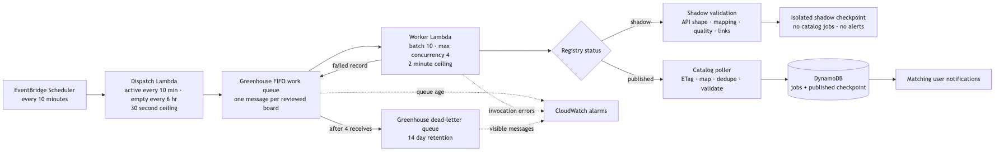

# Greenhouse monitoring architecture

The source is [architecture.mmd](architecture.mmd); a scalable
[SVG rendering](architecture.svg) is included as well.

## Deployment boundary

Greenhouse monitoring is deployed as the independent
`InternNotifsGreenhouse` CDK stack. It owns the scheduler, dispatcher, queues,
worker, and alarms, while importing the retained internships and user tables
by name from the existing `InternNotifs` stack. This separation permits a
Greenhouse-only deployment without modifying the lifecycle of the public API,
operations API, authentication, or durable data resources.

Use the exact deployment procedure in
[`../DEPLOYMENT.md`](../DEPLOYMENT.md#greenhouse-monitoring-deployment). Do not
deploy the main stack as a substitute for a Greenhouse-only change.

## Runtime flow

EventBridge invokes a small dispatcher every thirty minutes. The dispatcher
creates one FIFO message for every reviewed Greenhouse board. Each board ID is
its own message group, which prevents overlapping work for the same board while
allowing different boards to run concurrently.

Lambda automatically scales with queue backlog up to four worker invocations.
Each invocation receives at most ten messages and processes up to four board
groups concurrently. Records within one board group remain sequential, and
partial-batch responses return the failed record plus later records from that
same board to SQS.

Published boards run every thirty minutes whether their current snapshot is
active or quiet. Shadow boards run every three hours; their first checks are
staggered across dispatcher windows. A pause or provider backoff overrides both
cadences.

Shadow and published boards deliberately use different DynamoDB checkpoint
keys. Shadow polling validates API shape, role mapping, source quality, and
eligible application links but never writes jobs or sends alerts. When a board
is promoted, it has no published checkpoint, so its first catalog run becomes a
quiet baseline instead of alerting every role already open.

Greenhouse ETags make unchanged checks cheap; Lever always retrieves the full
paginated board and uses a stable content hash because its public endpoint does
not honor conditional requests. A changed published snapshot passes through
canonicalization, deduplication, official-link validation, DynamoDB storage,
and notification matching. The existing general notifier continues to
reconcile push receipts and the optional ntfy fallback.

## Capacity and failure boundaries

- Schedule: every thirty minutes for published boards; every three hours for shadow boards.
- Queue batch size: ten boards.
- Worker maximum concurrency: four.
- Worker timeout: two minutes.
- Queue visibility timeout: six minutes.
- Greenhouse API timeout: eight seconds per request.
- Queue retention: one day.
- Dead-letter retention: fourteen days.
- Dead-letter threshold: four receives.

CloudWatch alarms cover worker invocation errors, queue work older than ten
minutes, and any message arriving in the Greenhouse dead-letter queue.
