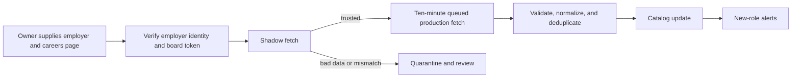

# Greenhouse ingestion plan

## Goal

Add Greenhouse as the next direct employer source. InternNotifs reads the employer's public Greenhouse Job Board API, not search results, aggregators, browser-rendered pages, or application APIs.

Employer selection stays with the owner. This plan starts when an owner supplies an employer and its official careers-page URL; it does not require a global company directory.

## Plain-language terms

- **Board token:** Greenhouse's public identifier for one employer's careers board. It is not a password or secret.
- **Canonical employer:** the one stored employer identity and display name used throughout the catalog.
- **Alias:** a deliberate alternate name used only to find the canonical employer, such as `Google LLC` or `TSLA`.
- **Snapshot:** every job currently returned by a board at one point in time.
- **Shadow mode:** checking a board without showing its jobs to users.

## End-to-end flow



## Employer identity and board configuration

Greenhouse does not accept a company name as a job-search query. It requires a known board token, so InternNotifs must never turn free-form employer text into a Greenhouse URL.

Each approved source has a reviewed record like this:

```text
employerId: google
displayName: Google
groupId: alphabet
aliases: [Google, Google LLC, Google DeepMind]
provider: greenhouse
boardToken: google
officialCareersUrl: https://careers.google.com
expectedApplicationHosts: [careers.google.com, job-boards.greenhouse.io]
```

The matcher normalizes harmless formatting—case, whitespace, punctuation, accents, and corporate suffixes—then performs an exact lookup against stored IDs and aliases. It never uses fuzzy matching or guesses a token.

- `TSLA` maps to `tesla` only when it is an explicit alias.
- `Alphabet` maps to an explicit `alphabet` group and its listed member board(s); it is not silently treated as every Google-branded publisher.
- Unknown or ambiguous input produces a review-needed result and makes no API request.

Aliases are lookup-only. Catalog records always use the canonical `displayName`, preventing one employer from appearing under several spellings.

## Exact public API reads

First verify the board identity once during admission:

```text
GET https://boards-api.greenhouse.io/v1/boards/{board_token}
```

Require the returned board name to match the reviewed employer identity. Then poll the complete public board:

```text
GET https://boards-api.greenhouse.io/v1/boards/{board_token}/jobs?content=true
```

These reads require no employer credentials. InternNotifs never calls Greenhouse's application `POST` endpoint.

For each returned job, use:

| Greenhouse field | InternNotifs use |
| --- | --- |
| `id` | Board-specific role record ID |
| `title` | Role title |
| `location.name` | Primary location |
| `updated_at` | Source update time |
| `content` | Plain-text description for role, compensation, and requirement checks |
| `departments`, `offices` | Additional source context |
| `absolute_url` | Official candidate handoff after validation |

Ignore prospect/general-interest posts where `internal_job_id` is `null`. The stable source ID is `greenhouse-{board_token}`; the catalog employer name comes from the reviewed identity record, not from an arbitrary response string.

Official reference: [Greenhouse Job Board API](https://developers.greenhouse.io/job-board).

## Queued fetch and update cycle

EventBridge dispatches active boards hourly. Reviewed boards with no
eligible roles automatically move to a staggered six-hour check until roles
appear. Each board is one FIFO SQS message; Lambda receives batches of ten and
scales to at most four concurrent workers.

1. Load the board's last successful hash, row count, success time, and active role IDs.
2. Build the request from the stored provider and board token only. Use the fixed `boards-api.greenhouse.io` host, encode the token as one path segment, and reject configuration that contains a URL, slash, query string, or unknown provider.
3. Fetch the jobs endpoint. Use an ETag if Greenhouse provides one; otherwise compare a SHA-256 hash of a normalized, sorted response.
4. Discard prospects and convert the response to the common role shape. The shared lifecycle classifier admits technical internships, co-ops, apprenticeships, new-grad programs, and explicitly entry-level titles; generic and merely junior titles remain excluded.
5. For every new or changed application URL, require HTTPS, reject aggregators, require an expected host or reviewed exception, then validate resolution with `HEAD` and a small ranged `GET` fallback.
6. Commit the complete successful snapshot and new source state together. Only then calculate role additions, edits, omissions, and closures.
7. Retry only failed SQS records. After four receives, move a persistent failure
   to the Greenhouse dead-letter queue and alarm.

## Catalog and notification behavior

- The first successful snapshot is a quiet baseline: roles enter the catalog but send no alerts.
- Later eligible additions are deduplicated by normalized application URL and conservative role fingerprint, then are eligible for notifications.
- Description, title, location, or compensation edits update the role but do not generate a new-role alert.
- A role missing from one successful snapshot is marked missing. Close that board's role record only after two consecutive successful complete snapshots omit it.
- Close the catalog role only when no active source still supports it.

An empty result from a board that previously returned roles is never a closure signal. It is a source-quality incident, and the existing catalog stays unchanged until a trustworthy complete snapshot arrives.

## Failure and trust decisions

| Result | Response | Catalog effect |
| --- | --- | --- |
| Unknown alias, malformed token, or board-name mismatch | Stop and request configuration review | No publication; preserve previous roles |
| Timeout, HTTP 429, or HTTP 5xx | Retry that board with increasing waits | Preserve previous roles |
| HTTP 404/401 or malformed JSON | Quarantine the board and alert | Preserve previous roles |
| Unexpected zero roles | Hold for review and alert | Do not close roles |
| One broken application link | Withhold/quarantine that role | Other board roles continue |
| Widespread broken links | Quarantine the board and alert | Preserve previous roles |

Every outcome records the source ID, run ID, failure category, retry count, safe diagnostic summary, and last known good state. It never includes applicant data or credentials.

## Rollout

1. Add the reviewed identity/source configuration, Greenhouse reader, fixtures, and unit tests.
2. Run a small owner-selected cohort in shadow mode and inspect identity matches, technical-role quality, link validity, and source health.
3. Promote stable boards, enable snapshot reconciliation, and connect operational alerts.
4. Scale board count using independent queue tasks without changing catalog semantics.

Success means every Greenhouse role is traceable to a verified employer board, remains current through safe snapshot updates, and never reaches students through an untrusted or broken application link.
