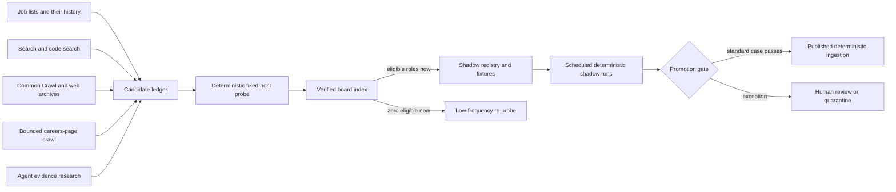

# Greenhouse registry expansion plan

## Purpose

Discover and verify as many legitimate Greenhouse employer boards as practical,
then continuously activate the boards that carry relevant technical
internships. The owner does not choose a roster or approve companies one by
one.

Discovery is intentionally broad, but an agent, a guessed company slug, a
search result, and an untrusted careers page never become the production trust
boundary.

The workflow is deliberately hybrid:

- deterministic harvesters collect board-token candidates from current and
  historical internship lists, web indexes, code search, and search results;
- an agent follows the evidence graph, resolves company identity, and
  investigates ambiguous or custom careers sites;
- deterministic code verifies every candidate against Greenhouse's public API;
- a human reviews exceptions, new custom application hosts, and production
  promotion policy rather than selecting the universe of companies;
- deterministic scheduled code performs all later ingestion.

This plan expands the implementation in
[`src/sources/greenhouse.ts`](../../src/sources/greenhouse.ts) and
[`src/sources/greenhouse-config.ts`](../../src/sources/greenhouse-config.ts). It
does not introduce automated application submission.

## Current baseline

On 2026-07-29, the owner chose a single-user rollout that publishes
API-responsive boards before completing first-party ownership review. This
supersedes the staged shadow-first sequence below without weakening runtime
identity, schema, host, link, or quiet-baseline gates.

The official registry now contains 166 published sources: three with completed
manual evidence and 163 marked `api-probed` for post-publication ownership
review. A fresh batch probe found 17,564 raw jobs, 304 candidate-eligible
technical internships, and zero malformed rows. The full live contract ran
against all 166 entries; 164 completed every check, while Mixpanel had a
transport-inconclusive identity request and Nirmata had one transport-
inconclusive link check. Neither was treated as a deterministic failure.

The original manually reviewed cohort remains:

| Employer | Board token | Raw jobs | Prospect jobs | Eligible technical internships | Malformed rows | Initial application host | ETag | Live contract |
| --- | --- | ---: | ---: | ---: | ---: | --- | --- | --- |
| Figma | `figma` | 180 | 0 | 0 | 0 | `boards.greenhouse.io` | Present | Passed |
| Datadog | `datadog` | 424 | 0 | 0 | 0 | `careers.datadoghq.com` | Present | Passed |
| Cloudflare | `cloudflare` | 279 | 0 | 5 | 0 | `boards.greenhouse.io` | Present | Passed |

The Cloudflare sample included current roles titled `Research Engineer Intern
(Fall 2026)`. The numbers above are operational observations, not fixtures or
capacity guarantees; job counts will change.

### Discovery feasibility snapshot

A live research run on 2026-07-29 measured the proposed discovery sources:

| Discovery source | Observation |
| --- | --- |
| 11 current internship-list documents already configured in this repository | 337 direct Greenhouse job links and 110 distinct board tokens |
| Greenhouse candidate probe of those 110 tokens | All 110 identity and jobs endpoints responded successfully |
| Jobs on those 110 boards | 10,836 raw jobs, 271 candidate-eligible technical internships, and zero malformed rows |
| Boards useful now | 92 of 110 had at least one candidate-eligible role |
| HTTP caching | All 110 returned an ETag |
| Initial application hosts | 5,249 jobs on `job-boards.greenhouse.io`, 5,186 on `boards.greenhouse.io`, and 401 on `job-boards.eu.greenhouse.io` |
| Four small search-engine queries | 12 board tokens; 9 were not present in the internship-list set |
| Probe of those 9 new search tokens | 8 passed immediately and 1 was transport-inconclusive; the successful boards added 424 raw jobs and 5 candidate-eligible roles |
| First 1,000 Common Crawl index rows for each modern Greenhouse host | 119 raw first-path candidates on the global host and 127 on the EU host |

The 110-board probe proves API reachability and response shape, not final
employer identity or application-link health. Common Crawl path candidates are
especially noisy and require syntax checks, deduplication, and live probing.

Examples among the 110 validated boards included Tenstorrent University Jobs
(21 candidate-eligible roles), DRW (13), Neuralink (12), Astranis (11), and
Point72 (10). The small web-search sample independently found Liberate,
DoubleVerify, Everpure/Pure Storage, Financial Times, Nirmata, Clockwork.io,
Xometry, Ritual, and Brevium outside the current internship-list candidate set.

The registry manifest, typecheck, identity checks, schema checks, ETag checks,
and eligible-role link checks cover the publication path. Bespoke sanitized
fixtures remain mandatory for the three manually reviewed boards; API-probed
entries use current live identity and host evidence until post-publication
review supplies equivalent artifacts.

What already exists:

- strict board-token validation;
- fixed-host identity and jobs API requests;
- exact reviewed board-name matching;
- a read-only candidate probe;
- technical early-career mapping and prospect-post exclusion;
- application-host allowlists;
- ETag and content-hash checkpoints;
- per-company fixtures and approval artifacts;
- a read-only live contract;
- an hourly EventBridge dispatcher;
- a FIFO SQS work queue with per-board ordering and deduplication;
- batches of ten with maximum worker concurrency four;
- isolated scheduled shadow checkpoints and link checks;
- a status-driven published path with a quiet first catalog baseline;
- partial-batch retries, a dedicated dead-letter queue, and CloudWatch alarms.

What is still missing:

- a multi-source, continuous discovery harvester;
- a durable provenance ledger beyond the checked-in registry data;
- a batch command around the existing candidate probe;
- agent tooling and evidence rules for first-party identity verification;
- a post-publication exception review queue and registry patch generator;
- retained per-board live-contract reports rather than workflow logs alone.

Published Greenhouse sources remain separate from `defaultSources` and flow
through the dedicated queue. The queue worker creates a quiet baseline
independently for every source, so existing roles become visible without being
announced as newly posted.

## External contract

Greenhouse documents a job board token as the customizable final part of a
board URL such as `https://boards.greenhouse.io/omnivacorp`. Public Job Board
API `GET` requests do not require authentication. The jobs endpoint is:

```text
GET https://boards-api.greenhouse.io/v1/boards/{board_token}/jobs?content=true
```

Only Greenhouse's application-submission `POST` endpoint requires credentials;
InternNotifs does not call it.

References:

- [Greenhouse Job Board API](https://developers.greenhouse.io/job-board)
- [Greenhouse: find your job board URL](https://support.greenhouse.io/hc/en-us/articles/5888210160155-Find-your-job-board-URL)
- [Greenhouse-hosted job board URL format](https://support.greenhouse.io/hc/en-us/articles/360020776251-Job-board-URL-for-Greenhouse-hosted-job-board)
- [Non-Greenhouse-hosted job boards](https://support.greenhouse.io/hc/en-us/articles/214375866-Job-board-URL-for-non-Greenhouse-hosted-job-boards)
- [Common Crawl Index Server](https://index.commoncrawl.org/)
- [Internet Archive Wayback CDX server](https://github.com/internetarchive/wayback/tree/master/wayback-cdx-server)
- [GitHub REST API rate limits](https://docs.github.com/en/rest/using-the-rest-api/rate-limits-for-the-rest-api)
- [Robots Exclusion Protocol, RFC 9309](https://www.rfc-editor.org/rfc/rfc9309.html)

## Trust model



The agent may find and interpret evidence, but it cannot:

- create API URLs from a guessed company slug;
- approve a custom application host;
- change a source to `published`;
- write directly to the production catalog;
- make an application `POST`.

## Stage 1: harvest board-token candidates widely

There is no owner-selected roster. Candidate discovery runs continuously and
unions several complementary sources. Every record retains provenance so stale
or low-quality sources can be measured and removed.

### 1A. Current and historical internship repositories

Start with the 11 documents already read by `src/sources/github.ts`. Extract
tokens from:

- `boards.greenhouse.io/{token}/jobs/{id}`;
- `job-boards.greenhouse.io/{token}/jobs/{id}`;
- `job-boards.eu.greenhouse.io/{token}/jobs/{id}`;
- official custom careers URLs paired with Greenhouse job IDs or embeds.

Then scan the Git history, archived season files, closed-role tables, and older
season repositories. Record repository, commit SHA, document path, row, company
label, role title, and observed URL. Do not treat the list's company label as
canonical identity.

This is the highest-yield first source: the current configured documents alone
produced 110 distinct live tokens, and 92 currently have relevant roles.

### 1B. Search engines

Run rotating, date- and region-aware queries such as:

```text
site:job-boards.greenhouse.io "software engineer intern"
site:job-boards.greenhouse.io "machine learning intern"
site:boards.greenhouse.io ("intern" OR "co-op" OR "apprentice")
site:job-boards.eu.greenhouse.io internship engineer
site:boards.greenhouse.io/{known-token} careers
```

Search is valuable for boards absent from curated internship repositories: four
small research queries found nine new candidate tokens, eight of which
validated immediately. Search results remain discovery leads because indexes
can be stale and snippets can mislabel employers.

Use a licensed search API or an agent's supported web-search tool. Do not scrape
consumer search-result HTML in violation of provider terms. Google has
[announced that its Custom Search JSON API is closed to new customers and will
end for existing customers on
2027-01-01](https://developers.google.com/custom-search/v1/overview), so the
implementation must use a provider-neutral search interface rather than depend
on that API.

### 1C. Common Crawl

Query recent Common Crawl CDX indexes for:

```text
job-boards.greenhouse.io/*
job-boards.eu.greenhouse.io/*
boards.greenhouse.io/*
```

Extract the first path segment, discard non-token shapes, and union several
monthly crawl indexes. The latest-index 1,000-row samples yielded 119 global and
127 EU path candidates, demonstrating breadth but also noise.

The public CDX server is for bounded queries. Common Crawl explicitly recommends
its downloadable or columnar indexes for bulk filtering, so a full-domain scan
must use those facilities rather than overload the interactive index server.

### 1D. GitHub code search

Search public default-branch code for:

```text
"job-boards.greenhouse.io/"
"boards.greenhouse.io/"
"boards-api.greenhouse.io/v1/boards/"
"gh_jid"
```

Likely evidence includes company careers-site source, embed configuration,
open-source job lists, and recruiting integrations. For known high-yield
repositories, clone and scan their full Git history rather than relying only on
default-branch code search.

GitHub gives code search a separate restrictive rate bucket. The collector must
read rate-limit headers, cache results by query and date, use low concurrency,
and stop on `403` or `429` until the documented reset.

### 1E. Web archives

Use older Common Crawl indexes and bounded Wayback CDX prefix/domain queries to
recover board URLs that disappeared from current job lists or search results.
Historical evidence can discover a token, but it cannot prove that the token
still belongs to the same employer. Every historical candidate must pass the
current Greenhouse identity and jobs endpoints and obtain current first-party
identity evidence.

### 1F. Careers-page crawling and public job sources

Once a candidate board name or company domain is known, crawl only a small,
bounded first-party surface:

- homepage and `/careers`, `/jobs`, or equivalent pages;
- declared sitemaps;
- same-site links from those pages;
- scripts or embeds containing Greenhouse hostnames or `gh_jid`;
- one or more official application links.

Public job aggregators and commercial job sites may supply candidate links only
when their terms permit the access. InternNotifs does not copy their job
descriptions or make them catalog sources; it follows candidate evidence to the
employer or Greenhouse API.

Automated crawling must identify itself, obey RFC 9309 `robots.txt`, respect
site terms, cache results, use per-domain budgets and low concurrency, and stop
on blocking or rate-limit responses. A sensible initial ceiling is 20 pages per
domain and one request per second, configurable downward.

### Candidate ledger

All harvesters write a deduplicated, append/update candidate ledger:

```json
{
  "boardToken": "cloudflare",
  "firstSeenAt": "2026-07-29T00:00:00Z",
  "lastSeenAt": "2026-07-29T00:00:00Z",
  "state": "discovered",
  "evidence": [
    {
      "kind": "internship-list",
      "source": "vanshb03/Summer2027-Internships",
      "revision": "commit-sha",
      "document": "OFFSEASON_README.md",
      "observedUrl": "https://boards.greenhouse.io/cloudflare/jobs/..."
    }
  ]
}
```

The ledger strips tracking parameters and omits descriptions, credentials, and
personal data. A token must come from a captured URL or explicit embed/config
value. Harvesters never generate likely slugs from company names.

## Stage 2: agent-assisted identity verification

The agent works the candidate ledger rather than browsing companies at random.
For each syntactically valid token it:

1. runs the deterministic Greenhouse probe;
2. takes the returned board name as a lead, not automatically as the catalog
   company name;
3. searches the exact board name and token for a current official company site;
4. opens the likely first-party careers page;
5. looks for a link, embed, script, or application handoff containing the same
   token;
6. follows at least one current job URL and records the initial and final host;
7. checks whether the board represents a parent, subsidiary, recruiting agency,
   regional board, university board, or shared hiring entity;
8. captures the minimum evidence needed to reproduce the conclusion.

The agent emits one of these states:

- `identity-verified`: current Greenhouse identity plus current first-party
  careers evidence agree;
- `api-verified`: Greenhouse is live, but first-party ownership evidence is not
  yet sufficient;
- `ambiguous-owner`: multiple plausible companies or a shared board;
- `custom-host-review`: ownership is clear but application hosts need an
  explicit exception;
- `stale-or-reassigned`: historical evidence conflicts with current identity;
- `inconclusive`: transport, blocking, or unavailable evidence.

Suggested identity evidence:

```json
{
  "boardToken": "cloudflare",
  "greenhouseBoardName": "Cloudflare",
  "canonicalEmployerId": "cloudflare",
  "displayName": "Cloudflare",
  "officialCareersUrl": "https://www.cloudflare.com/careers/",
  "firstPartyEvidenceUrl": "https://www.cloudflare.com/careers/",
  "observedBoardUrl": "https://boards.greenhouse.io/cloudflare/jobs/...",
  "initialHosts": ["boards.greenhouse.io"],
  "expectedFinalHosts": ["job-boards.greenhouse.io"],
  "state": "identity-verified",
  "verifiedAt": "2026-07-29T00:00:00Z"
}
```

### Agent queue mechanics

The agent receives a bounded queue, not a vague instruction to “find
companies.” The queue is sorted by:

1. candidate-eligible role count;
2. number and freshness of independent discovery sources;
3. presence of a current direct job URL;
4. standard Greenhouse host before a custom-host exception;
5. unresolved boards before already verified zero-eligible boards.

For each item, the agent uses a repeatable search sequence:

```text
"{exact Greenhouse board name}" careers
"{board token}" greenhouse
site:{candidate company domain} (greenhouse OR gh_jid)
site:{candidate company domain} (careers OR jobs)
```

It inspects the official site's careers links, page source or scripts when
needed, and a current application redirect. It stops successfully when the
current first-party site and Greenhouse identity form a reproducible chain. It
stops as an exception—without forcing a conclusion—when ownership is shared,
the names conflict, the official site cannot be established, robots or terms
block access, or a custom application host is unexplained.

The queue result includes URLs, timestamps, source revisions, normalized names,
host summaries, and reason codes. It does not rely on prose alone such as “this
looks like the same company.”

Agent discovery is intentionally non-deterministic because careers sites,
JavaScript, redirects, subsidiaries, and custom domains vary. The evidence
snapshot and API results are machine-checkable; semantic ambiguities go to a
human exception queue. Ordinary exact matches do not require the owner to
select or approve the company.

## Stage 3: deterministic batch probe

Add a thin command around the existing `probeGreenhouseCandidate` function:

```bash
npm run greenhouse:probe -- \
  --input artifacts/greenhouse-discovery-candidates.json \
  --output artifacts/greenhouse-probe-report.json
```

For every explicitly supplied candidate token, the command:

1. validates the lowercase token syntax;
2. calls only `boards-api.greenhouse.io`;
3. reads board identity;
4. reads `jobs?content=true`;
5. validates every row against the documented shape;
6. counts raw, prospect, eligible, and malformed rows;
7. summarizes initial application hosts;
8. reports ETag presence;
9. emits at most three eligible role IDs and titles;
10. never changes the registry.

Proposed result shape:

```json
{
  "generatedAt": "2026-07-29T00:00:00Z",
  "inputHash": "sha256:...",
  "discoveryOnly": true,
  "results": [
    {
      "employerId": "cloudflare",
      "boardToken": "cloudflare",
      "state": "ok",
      "boardName": "Cloudflare",
      "rawJobs": 279,
      "prospectJobs": 0,
      "candidateEligibleJobs": 5,
      "malformedRows": 0,
      "etagPresent": true,
      "initialHostSummary": {
        "boards.greenhouse.io": 279
      },
      "identityEvidenceState": "identity-verified"
    }
  ]
}
```

The report is deterministic for a captured response, but live counts are
time-dependent. Unit tests therefore use sanitized fixtures; live runs record
their timestamp and input hash.

The command should support:

- `--token <token>` for one-off investigation;
- `--input <file>` for a batch;
- `--output <file>` for the review queue;
- `--offline-fixtures <directory>` for repeatable tests;
- `--strict` to exit nonzero when any candidate is invalid or inconclusive.

It should not accept a company name in place of a token.

## Stage 4: verified index and exception review

Do not put every live board into the scheduled source registry. Maintain three
separate layers:

1. **Candidate ledger:** every deduplicated token and its discovery provenance.
2. **Verified board index:** boards with a successful current API probe and
   sufficient identity evidence, including boards with no relevant roles today.
3. **Active source registry:** verified boards with relevant roles that are in
   shadow or published ingestion.

A standard board moves into the verified index when:

- the token came from captured evidence rather than slug guessing;
- the fixed-host probe succeeds;
- the returned board name and current first-party careers evidence agree;
- all rows match the documented API shape;
- observed application hosts are normal Greenhouse hosts;
- there is no unexplained employer, subsidiary, or shared-board ambiguity.

Human review is reserved for:

- a non-Greenhouse application host;
- board-name and first-party-name disagreement;
- parent/subsidiary or shared recruiting boards;
- recruiting agencies and talent-community boards;
- evidence that a historical token was reassigned;
- production promotion policy changes.

Examples from the current registry:

- Figma and Cloudflare use `boards.greenhouse.io` initially and
  `job-boards.greenhouse.io` finally.
- Datadog uses `careers.datadoghq.com`, so its registry entry includes an
  explicit host-exception reason.

The admission command generates a verified-index record or exception artifact.
Only boards with candidate-eligible roles generate an active-registry patch:

```bash
npm run greenhouse:admit -- \
  --candidate greenhouse-cloudflare \
  --report artifacts/greenhouse-probe-report.json \
  --emit-patch artifacts/greenhouse-cloudflare.patch
```

A standard generated patch begins with `status: "shadow"`. An exception patch
cannot be generated until its review fields are complete.

Verified boards with zero eligible roles stay out of hourly ingestion and
receive a staggered six-hour jobs re-probe. When eligible roles appear, they
automatically become active-registry candidates without rediscovery.

### Operating cadence

| Work | Initial cadence |
| --- | --- |
| Diff configured internship-list documents | Daily |
| Scan new commits and newly discovered internship repositories | Daily |
| Rotate web and code-search queries | Daily within provider quotas |
| Query a new Common Crawl index | When each crawl index is published |
| Revisit historical web indexes | Monthly |
| Probe newly discovered tokens | Immediately, with concurrency 4 and backoff |
| Work agent identity queue | Continuously in bounded batches |
| Re-probe verified zero-eligible boards | Weekly |
| Poll active shadow/published boards | Hourly |
| Re-probe verified zero-eligible boards | Staggered every six hours |

Cadence is configurable and must back off on `429`, `5xx`, transport failure,
or provider-specific quota exhaustion.

## Stage 5: evidence and CI gate

Every **active** board continues to require:

```text
test/fixtures/greenhouse/{boardToken}/
  identity.json
  jobs.json
  approval.json
```

Fixtures are small and sanitized. They must cover:

- the board's real application-host pattern;
- one eligible technical early-career role;
- one non-eligible role;
- one prospect post.

The approval artifact records source ID, run time, commit SHA, real live counts,
and host summary. It does not contain full live payloads.

The larger verified-board index does not require a bespoke eligible-role fixture
for every zero-eligible board. It is validated by:

- a versioned schema;
- unique token and employer/source IDs;
- a current fixed-host identity result;
- first-party evidence URL shape;
- evidence timestamps and source provenance;
- host-policy classification;
- deterministic captured-response tests for the index generator.

This separation lets InternNotifs verify hundreds or thousands of boards
without pretending they all need hourly polling or manufacturing an
eligible fixture for boards that have no relevant role.

Required CI commands:

```bash
npm run greenhouse:manifest
npx vitest run \
  test/greenhouse-config.test.ts \
  test/greenhouse-candidate.test.ts \
  test/greenhouse-fixtures.test.ts \
  test/greenhouse.test.ts
npm run typecheck
npm run lint
```

The live suite remains separate because network failure is inconclusive:

```bash
npm run test:greenhouse:live
```

## Stage 6: make shadow mode real — implemented

> Superseded for the owner-only rollout on 2026-07-29. The live contract remains
> scheduled for post-publication validation.

The scheduled queue worker constructs adapters for any registry entries whose
status is `shadow`, but never sends their listings to catalog reconciliation or
notifications. Shadow checkpoints use a separate key so promotion always
starts with a quiet published baseline.

Each run records:

- source ID and run ID;
- identity result;
- raw, eligible, and withheld counts;
- ETag or content-hash behavior;
- malformed-row count;
- initial and resolved host summaries;
- application-link health;
- duration and safe failure category.

Shadow output should use the existing operational artifact/report pattern. It
must not log descriptions, credentials, full query strings, or applicant data.

Initial proposed promotion evidence:

- at least three successful shadow runs spanning at least 24 hours;
- exact identity and valid schema on every successful run;
- zero malformed rows;
- no unexplained application hosts;
- ETag `304` behavior when an ETag is supplied;
- link failures at or below the existing 20% board quarantine threshold;
- a manually reviewed sample of eligible and deliberately excluded roles.

These thresholds are starting rules. Revisit them after the first 100
identity-verified boards produce real custom-host, zero-eligible, and
link-failure rates.

Cloudflare is the best existing end-to-end publication pilot because it
currently produces five eligible roles. Figma and Datadog are useful controls:
a healthy board with zero eligible internships must remain healthy and publish
nothing, rather than being treated as a failure.

## Stage 7: publish a board

> Completed in bulk for the 166-board owner-only rollout. The steps below remain
> the intended policy when the product expands beyond its single user.

Promotion is an explicit reviewed code change:

1. change the registry status from `shadow` to `published`;
2. deploy the reviewed registry change;
3. let the queue worker create a quiet first published snapshot;
4. verify catalog entries without notifications;
5. allow later genuinely new roles to enter notification evaluation.

The queue worker resolves the current registry status at processing time.
Changing `status` is therefore the only runtime routing change, but review,
tests, deployment, and baseline verification remain required promotion gates.

Publication must preserve the existing catalog rules:

- the first successful snapshot is a quiet baseline;
- one missing snapshot does not close a role;
- two complete successful omissions are required for closure;
- an unexpected empty board preserves the last known good state;
- a broken role URL withholds that role;
- widespread failures quarantine the board;
- canonical company names come from the reviewed registry.

## Delivery sequence

### PR 1 — Probe command and review artifact

- wrap `probeGreenhouseCandidate` in a batch CLI;
- define versioned input/output schemas;
- add offline fixture mode and command tests;
- document exit codes and safe logging.

Exit criterion: the three current boards reproduce their expected identity,
host, schema, and eligibility results through the new command.

### PR 2 — Broad discovery harvesters

- extract direct Greenhouse tokens from the 11 configured internship documents;
- scan those repositories' season files and Git history;
- add provider-neutral web-search ingestion;
- add bounded Common Crawl index collection;
- optionally add rate-aware GitHub code search and Wayback collection;
- deduplicate candidates into a provenance-preserving ledger;
- enforce robots, request budgets, caching, and safe-source policies.

Exit criterion: the current internship documents reproduce the observed 110
tokens, and every candidate retains the URL and source revision that exposed
it.

### PR 3 — Agent identity workflow and verified index

- give the agent a queue ordered by live relevant-role count and evidence
  quality;
- capture first-party careers evidence and identity decisions;
- create the verified-board index and exception states;
- generate active-registry patches only for identity-verified boards with
  relevant roles;
- create a low-frequency re-probe path for verified zero-eligible boards;
- create sanitized per-company fixtures and approval artifacts;
- enforce manifest and duplicate-token gates.

Exit criterion: standard boards can become identity-verified without an
owner-selected roster, while ambiguous and custom-host cases reliably stop in
the exception queue.

### PR 4 — Scheduled shadow runner — implemented

- schedule shadow-only adapters;
- persist safe health reports;
- ensure zero catalog writes and zero notifications;
- run the first cohort for at least 24 hours.

Exit criterion: promotion evidence exists for each board and failures preserve
catalog state.

### PR 5 — Cloudflare production pilot

- publish Cloudflare first;
- seed a quiet baseline;
- verify the five currently eligible roles or explain live count changes;
- monitor source health and notification suppression.

Exit criterion: Greenhouse listings reach the catalog through a reviewed board,
the first snapshot sends no alerts, and later polls reconcile safely.

### PR 6 — Scale and reconcile documentation

- promote other stable boards;
- run discovery continuously across new job-list revisions, search results, and
  web-index snapshots;
- work the agent evidence queue in descending eligible-role and confidence
  order;
- re-probe verified inactive boards so newly opened internships enter shadow;
- update `docs/product-roadmap.md`;
- record actual admission yield, custom-host rate, zero-eligible rate, probe
  duration, and failure categories;
- use those measurements to tune the existing independent queue tasks.

## Ownership

| Activity | Agent | Deterministic code | Human |
| --- | --- | --- | --- |
| Harvest current and historical board URLs | Direct investigation for difficult pages | Yes for structured sources | No |
| Search web, code, and archive indexes | Form queries and interpret results | Deduplicate and retain provenance | No |
| Find official careers-page evidence | Research and resolve identity | Validate captured URL/host relationships | Review exceptions |
| Validate token syntax and Greenhouse identity | No | Yes | No for standard matches |
| Count/map roles and summarize hosts | No | Yes | Review samples |
| Approve custom application hosts | No | Validate allowlist | Approve |
| Add verified-index record | Supply evidence | Generate and validate | Review exceptions |
| Add standard shadow registry record | No | Generate and validate | Approve promotion policy |
| Poll admitted boards | No | Yes | Monitor |
| Promote to production | No | Enforce gates | Approve |

## Success measures

Track these from continuous discovery rather than choosing a fixed roster:

- unique tokens discovered by source and crawl date;
- discovery-source overlap and marginal new-token yield;
- API-valid, identity-verified, ambiguous, and stale candidates;
- companies confirmed on Greenhouse;
- candidates rejected for identity mismatch;
- candidates with custom application hosts;
- boards with zero currently eligible roles;
- verified inactive boards that later open eligible roles;
- time from token discovery to API verification and identity verification;
- malformed-row rate;
- link-failure and inconclusive-request rates;
- median and p95 probe duration;
- agent minutes per standard and exception identity case;
- shadow-to-published promotion rate;
- duplicate alert rate after publication.

The final system is successful when discovery coverage grows without owner
roster work, an agent can resolve the long tail of careers-site identity, and
the same checked-in evidence plus captured API response always produce the same
technical admission, mapping, and publication behavior.
