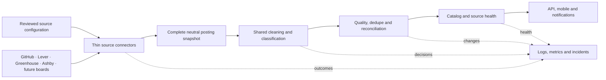

# Standardized job ingestion architecture

## Goal

All production sources cross one provider-neutral boundary before catalog
policy is applied. Connectors prove that a snapshot is complete and preserve
provider identity; shared processing owns cleaning and eligibility; pure
reconciliation decides catalog changes; persistence only stores those changes.

This refactor deliberately preserves existing source IDs, URL/fingerprint job
IDs, eligibility decisions, quiet baselines, and notification behavior.
Eligibility improvements ship separately after compatibility is proven.

## Contracts

A `SourceConnector` returns a complete `SourceSnapshot`. Each
`SourcedPosting.externalId` is stable within its source: ATS posting IDs for
Lever, Greenhouse, and Ashby, and document path plus normalized application URL for
Markdown. Two Markdown rows that share one normalized application URL are one
destination, so the repeat is dropped and still counted in `rawCount` rather
than failing the snapshot. Row numbers remain diagnostics only.

Connectors own transport, pagination, schema validation, source identity,
completeness, stable provider IDs, and reviewed URL contracts. They classify
failures so the runner can retry transport, `429`, and `5xx` and quarantine
configuration, schema, identity, and URL-contract failures. They do not decide
whether a structurally valid posting is a technical early-career role.

The shared processor returns processed listings and an explicit decision for
every posting. It owns text cleanup, generic URL safety, work-mode/location
normalization, lifecycle and technical classification, season inference,
compensation, and declared requirement extraction. `lifecycleAuthority` records
where the lifecycle signal comes from: `title` requires explicit internship,
co-op, apprenticeship, new-grad, or entry-level wording; `posting` trusts a
provider field that explicitly marks that row as an internship; and `source`
trusts a reviewed early-career-only document for every row it lists. A generic
technical title, experience-range prose, or “junior” alone never qualifies.

The reconciler is pure. It calculates creates, updates, first omissions,
second-omission closures, and deterministic notification events. One snapshot
that lists a role twice — across documents or behind different tracking links —
merges into one role with one alert. A role remains open while any source
occurrence is open. Failed, incomplete, malformed, or suspicious raw-zero
snapshots never reach reconciliation.

The store persists catalog records, occurrences, checkpoints, deterministic
outbox records, and source health. An occurrence is written only when its
presence, omission streak, role, or payload changes; a confirmation costs no
write because the checkpoint carries the active ID set. Recording an outbox
event is the alert gate, so a retried snapshot re-derives the same event ID and
stays quiet. Checkpoints advance only after all writes for a snapshot succeed.
Store indexes use the already-processed catalog state and never re-run
classification.

### Catalog and source time facts

Catalog timestamps and provider timestamps answer different questions and are
never substituted for one another:

- `Internship.firstSeenAt` is the immutable time InternNotifs first observed the
  canonical job. It is not a provider creation or publication time.
- `Internship.catalogVisibleAt` is the immutable time that canonical job became
  visible in the InternNotifs catalog. `catalogRecency=normal` sorts by this
  value; `baseline` remains browseable but sorts after every normal job.
- `SourceOccurrenceState.firstObservedAt` is when InternNotifs first observed
  that source-local posting. Its precision field marks legacy unknowns.
- `SourceOccurrence.firstAttachedAt` is when that source occurrence was first
  attached to the canonical catalog job. Attaching a provider baseline to an
  existing community job does not change the job's catalog timestamps or rank.
- `SourceOccurrence.providerTimestamp` retains the provider's declared
  `published` or `updated` semantics. In particular, an `updated` value is never
  converted into a creation, observation, attachment, or visibility time.

The open sparse-index key starts with the recency rank and then uses
`catalogVisibleAt#jobId`. Normal rows use rank `3`; baseline rows use rank `1`.
This makes one descending query return every normal role before any baseline
role. Legacy unranked normal keys remain readable during rollout and the catalog
index audit canonicalizes them.

## Compatibility and rollout

Migration order is Greenhouse, Lever, general GitHub Markdown, then Quant
Markdown. During migration, `RawListing` remains a deprecated alias for
`ProcessedListing`, and the legacy `SourceAdapter`/`SourceFetchResult` names
remain aliases for the neutral connector contract where callers still need
them.

The first trusted snapshot for a source is always quiet. Unchanged successful
snapshots are healthy and can advance omission streaks because they confirm
the same complete active snapshot; they reconcile omissions only, so identical
source content never rewrites the catalog. One omission marks an occurrence
missing; the second consecutive complete success closes it. Updates never
become new job alerts.

## Runtime and deferred scaling

The existing poll Lambda remains the orchestrator. Greenhouse keeps its
SQS-backed shadow/published scheduling, Ashby's five reviewed boards remain
adapter-only and shadow-only pending their runtime issue, and Firecrawl remains discovery-only.
Per-source queues for every provider, dynamic operator configuration, and a
management UI are deferred until source volume requires them.

Source health records and structured events make unchanged success, transient
provider failure, rejected snapshots, persistence failure, and stale sources
distinct. Metrics use provider/outcome/category dimensions; source IDs stay in
logs and health records to avoid unbounded metric cardinality.

Provider admission and incident response remain provider-specific:

- [Lever company onboarding](lever-company-onboarding-plan.md)
- [Lever monitoring and recovery](lever-monitoring-plan.md)
- [Greenhouse operations](greenhouse/README.md)
- [Ashby discovery, admission, and adapter](ashby-onboarding.md)
