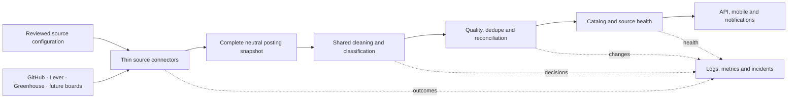

# Standardized job ingestion architecture

## Goal

All production sources cross one provider-neutral boundary before catalog
policy is applied. Connectors prove that a snapshot is complete and preserve
provider identity; shared processing owns cleaning and eligibility; pure
reconciliation decides catalog changes; persistence only stores those changes.

This refactor deliberately preserves existing source IDs, URL/fingerprint job
IDs, eligibility decisions, quiet baselines, and notification behavior.
Eligibility improvements ship separately after compatibility is proven.

## Contracts

A `SourceConnector` returns a complete `SourceSnapshot`. Each
`SourcedPosting.externalId` is stable within its source: ATS posting IDs for
Lever and Greenhouse, and document path plus normalized application URL for
Markdown. Row numbers remain diagnostics only.

Connectors own transport, bounded retries, pagination, schema validation,
source identity, completeness, stable provider IDs, and reviewed URL
contracts. They do not decide whether a structurally valid posting is a
technical early-career role.

The shared processor returns processed listings and an explicit decision for
every posting. It owns text cleanup, generic URL safety, work-mode/location
normalization, lifecycle and technical classification, season inference,
compensation, and declared requirement extraction.

The reconciler is pure. It calculates creates, updates, first omissions,
second-omission closures, and deterministic notification events. A role remains
open while any source occurrence is open. Failed, incomplete, malformed, or
suspicious raw-zero snapshots never reach reconciliation.

The store persists catalog records, occurrences, checkpoints, deterministic
outbox records, and source health. Checkpoints advance only after all writes
for a snapshot succeed. Store indexes use the already-processed catalog state
and never re-run classification.

## Compatibility and rollout

Migration order is Greenhouse, Lever, general GitHub Markdown, then Quant
Markdown. During migration, `RawListing` remains a deprecated alias for
`ProcessedListing`, and the legacy `SourceAdapter`/`SourceFetchResult` names
remain aliases for the neutral connector contract where callers still need
them.

The first trusted snapshot for a source is always quiet. Unchanged successful
snapshots are healthy and can advance omission streaks because they confirm
the same complete active snapshot. One omission marks an occurrence missing;
the second consecutive complete success closes it. Updates never become new
job alerts.

## Runtime and deferred scaling

The existing poll Lambda remains the orchestrator. Greenhouse keeps its
SQS-backed shadow/published scheduling, and Firecrawl remains discovery-only.
Per-source queues for every provider, dynamic operator configuration, and a
management UI are deferred until source volume requires them.

Source health records and structured events make unchanged success, transient
provider failure, rejected snapshots, persistence failure, and stale sources
distinct. Metrics use provider/outcome/category dimensions; source IDs stay in
logs and health records to avoid unbounded metric cardinality.

Provider admission and incident response remain provider-specific:

- [Lever company onboarding](lever-company-onboarding-plan.md)
- [Lever monitoring and recovery](lever-monitoring-plan.md)
- [Greenhouse operations](greenhouse/README.md)
