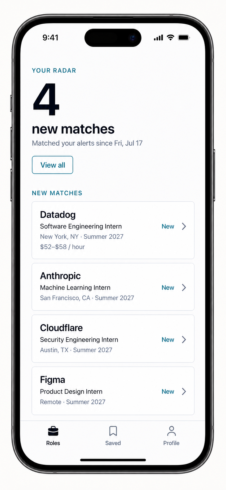

# New since last open

## Product behavior

When a signed-in, onboarded user launches InternNotifs, open a focused inbox before the usual feed when new roles matched their saved alert filters since the last app launch. The headline states the count and interval; cards use the existing role-detail sheet and official-form handoff. One secondary action, **View all internships**, returns to the normal feed.

An empty interval should not interrupt browsing: go straight to the feed. A user’s first launch after this feature ships establishes their baseline and shows no historic backlog. Guest browsing stays unchanged and never records a personal launch time.



## Visual and navigation direction

Make the count the visual hero: `4` becomes the large headline, followed by **new matches** and then the compact interval, “Matched your alerts since Fri, Jul 17.” This directly answers the user's first question—how much changed—without spending the largest type on a sentence they already understand from context. Keep **View all** as the one quiet secondary action.

Replace the current top text tabs with one persistent bottom bar: **Roles**, **Saved**, and **Profile**. Each target has a familiar icon above its one-word label: a filled briefcase for the selected Roles tab, bookmark for Saved, and person for Profile. The selection uses ink and a filled icon; inactive tabs use muted slate and outline icons. Do not use the bar for actions, add a fourth destination, or hide labels.

This is a particularly strong fit for the product's three peer sections. Apple's current guidance describes tab bars as navigation between top-level sections, recommends fewer tabs, persistent availability, short labels, and familiar SF Symbols; Android's guidance likewise recommends a bottom navigation bar for three to five equally important, persistent destinations in compact windows. The direction also follows Apple's principle of clear hierarchy and concise wording.

Sources: [Apple tab bars](https://developer.apple.com/design/human-interface-guidelines/tab-bars), [Apple SF Symbols](https://developer.apple.com/design/human-interface-guidelines/sf-symbols), [Android navigation bars](https://developer.android.com/develop/ui/compose/components/navigation-bar), and [Apple design principles](https://developer.apple.com/design/human-interface-guidelines/design-principles).

## Walkthrough mockups

1. [New matches at launch](mockups/new-since-last-opened-v2.png)
2. [Browse open roles](mockups/roles-feed-v4.png)
3. [Open a role and hand off to the official employer application](mockups/role-detail-sheet.png)
4. [Track saved applications](mockups/saved-applications.png)
5. [Tune alerts and matching filters](mockups/profile-alerts.png)

At most 50 cards are included in the launch inbox. When more roles match, show the total plus a concise “Showing the newest 50” note and preserve **View all internships** as the route to the complete catalog.

When the user leaves the launch inbox for the normal Roles list, retain the current launch's job IDs for that foreground session. Matching new roles stay at the top in a **New roles** group. A passive “You’re all caught up” divider followed by **Seen roles** separates the earlier feed—no startup alert or modal. This provides clear hierarchy and grouping in the list while keeping the feed simple. See [Apple’s list guidance](https://developer.apple.com/design/human-interface-guidelines/lists-and-tables) and [design principles](https://developer.apple.com/design/human-interface-guidelines/design-principles).

New cards get a little reward without becoming a distraction: on first render, they rise 8 pt while a pale-teal sheen fades once; the first five cards stagger by 80 ms. A tiny sparkle-and-**New** marker remains for recognition after the motion ends. There is no looping or pulsing animation, and Reduce Motion displays the same cards without animation. This follows React Native’s [AccessibilityInfo](https://reactnative.dev/docs/accessibilityinfo) Reduce Motion API and its native-driver [Animated](https://reactnative.dev/docs/0.82/animated) guidance for opacity and transforms.

## API contract

`POST /me/opening` is authenticated and has no request body. It returns:

```json
{
  "jobs": [],
  "total": 0,
  "hasMore": false,
  "previousOpenedAt": "2026-07-18T12:00:00.000Z",
  "openedAt": "2026-07-19T12:00:00.000Z"
}
```

`jobs` are open technical internships whose `firstSeenAt` is strictly after `previousOpenedAt` and no later than `openedAt`, after applying the saved role and employer filters. The call then records `lastCatalogOpenedAt`. On first use, `previousOpenedAt` is `null`, with no jobs and no historical scan.

The implementation uses the existing `openJobsIndex` and its `firstSeenAt#jobId` sort key, so it needs no new DynamoDB index or infrastructure migration. Saving profile/alert preferences preserves the launch marker.

## Mobile integration

After token restoration and preference loading, the mobile client calls `POST /me/opening` once per foreground app launch. If `total > 0`, it routes to the inbox; otherwise it renders the standard feed. The mobile shell uses the persistent bottom Roles, Saved, and Profile navigation specified above. The inbox is not a push notification, badge, or new tab: it is a calm, transient launch surface. Job cards retain the current role-detail and employer-official-application behavior.
