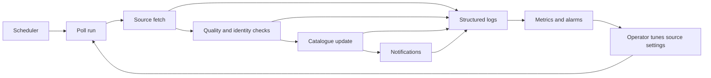

# Pipeline observability and source-tuning plan

## Goal

Make every fetch, quality decision, catalogue write, and notification outcome
observable enough to operate individual employer sources safely. Logs should
answer *what happened*, metrics should show *how often*, and source settings
should let an operator adjust one employer without a deploy.

This plan covers the existing poller and notification flow first, then applies
to Greenhouse and later job-board providers. It does not log résumés, account
data, application form answers, job descriptions, or URL query strings.

## Terms

- **Run** — one scheduled `poll` or `digest` invocation.
- **Source** — one configured employer/provider board, such as `lever:acme` or
  `greenhouse:acme`.
- **Outcome** — a named result such as `success`, `not_modified`,
  `invalid_configuration`, `temporary_provider_error`, or `catalogue_risk`.
- **Source setting** — an operator-controlled value for one source: enabled
  state, polling tier, expected hosts, and backoff limits. It is separate from
  user notification preferences.

## Operating model



Every event uses one JSON envelope. Lambda's normal CloudWatch log stream is
the delivery mechanism; no new ingestion service is needed for the first
release. A shared logger emits JSON rather than ad-hoc `console.log` strings.

```ts
{
  event: 'source_fetch_completed',
  occurredAt: '2026-07-24T14:02:09.183Z',
  runId: 'aws-request-id',
  command: 'poll',
  sourceId: 'greenhouse:acme',
  employerId: 'acme',
  provider: 'greenhouse',
  outcome: 'success',
  durationMs: 184,
  listingCount: 23,
  configVersion: 7
}
```

`runId` joins every event from one Lambda invocation. `sourceId` and
`configVersion` make it possible to compare a source before and after a tuning
change. A source event must use a canonical employer ID, not the name returned
by a job board.

## Events to retain

| Stage | Event | Key fields | Why it matters |
| --- | --- | --- | --- |
| Run | `poll_started`, `poll_completed` | source count, duration, jobs created, failures | Detect a stalled or unexpectedly costly run. |
| Fetch | `source_fetch_completed`, `source_fetch_failed` | provider, outcome, HTTP status class, duration, listing count, retry/backoff state | Tune cadence and distinguish provider trouble from bad setup. |
| Quality | `source_quality_rejected` | failed checks, previous/current counts, source | Keep suspicious snapshots from silently changing the catalogue. |
| Listing | `listing_created`, `listing_updated`, `listing_filtered`, `listing_quarantined` | source, reason code, job ID hash | Explain catalogue changes without storing the listing payload. |
| Link | `application_link_checked`, `application_link_failed` | expected-host result, HTTP status class, duration, reason code | Find broken or unexpected application destinations. |
| Notification | `notification_sent`, `notification_failed`, `push_receipt_failed` | channel, count, provider response class | Separate new-job detection from delivery failures. |
| Configuration | `source_setting_changed`, `source_auto_paused` | field names, old/new non-secret values, actor class, reason | Audit a tuning decision and prevent repeated bad work. |

Use stable reason codes such as `unknown_board`, `rate_limited`,
`network_timeout`, `unexpected_application_host`, `snapshot_count_drop`, and
`write_failed`. Keep a short, sanitized error summary for debugging, but never
make raw provider responses or stack traces a required query field.

## Metrics and alarms

The logger also emits low-cardinality CloudWatch metrics (via Embedded Metric
Format) for each outcome. Metrics use `provider`, `outcome`, and `command` as
dimensions. `sourceId`, `employerId`, job ID, and URL stay in logs because they
would create an unbounded metric-cardinality bill.

| Metric | Alarm / dashboard question |
| --- | --- |
| `RunFailure`, `RunDurationMs` | Did the scheduled pipeline finish inside its four-minute Lambda limit? |
| `SourceFetchFailure` by provider/outcome | Is a provider unavailable, rate-limiting us, or is one board configured incorrectly? |
| `SourceFreshnessMinutes` | Which enabled source has not completed successfully within its promised cadence? |
| `QualityRejection` | Is a bad snapshot being held out of the catalogue? |
| `ListingCreated`, `ListingQuarantined` | Did a source suddenly produce no roles or many unsafe links? |
| `NotificationFailure` | Are users missing alerts even though jobs were found? |
| `DeadLetterQueueDepth` | Did Scheduler fail to invoke Lambda after its retries? |

Alarm routing belongs in the reliability work: page only for pipeline-wide
failure, aged sources above their service target, or growing DLQ depth. Send
single-source configuration problems to an operator review queue or email
digest so a broken employer does not become an incident.

## Source settings

Store settings in a versioned, operator-managed record keyed by `sourceId`.
The initial source definition can remain in code, but overrides need a durable
store so a pause or cadence change does not require a release.

### Priority policy

Every confirmed, enabled published provider board uses the same thirty-minute
discovery objective. Active and quiet describe current listing state without
changing that cadence. The top-tier list identifies employers, not board IDs:
an employer without a confirmed provider board produces an `unknown_board`
setup item and makes no speculative network calls.

| Status | Eligible source | Target schedule | Freshness target |
| --- | --- | --- | --- |
| `published` | Every reviewed catalog board | Every 30 minutes | At most 90 minutes |
| `shadow` | Reviewed pre-publication board | Every 3 hours | Shadow interval + one scheduler cycle |
| `paused` | Invalid, disabled, or operator-paused board | No fetch | Not applicable |

Provider backoff may defer either scheduled status only for documented
temporary failures; an invalid board identifier requires repair rather than
repeated requests.

```ts
{
  sourceId: 'greenhouse:acme',
  enabled: true,
  pollTier: 'priority',            // all confirmed top-tier sources start here
  expectedApplicationHosts: ['jobs.acme.com', 'job-boards.greenhouse.io'],
  maxConsecutiveTemporaryFailures: 6,
  quietBoardBackoff: 'daily',
  pausedUntil: undefined,
  version: 7,
  changedAt: '2026-07-24T14:00:00Z',
  changedBy: 'operator'
}
```

Provider board identifiers and secrets are configuration inputs, but log only
the `sourceId` and a redacted identifier fingerprint. Never log credentials,
request authorization headers, user IDs, device tokens, raw job content, or
full application URLs. For a URL event, retain the normalized host and path
class only; drop the query and fragment.

The scheduler selects due, enabled sources based on their tier. A source that
repeatedly receives temporary provider errors backs off automatically and emits
`source_auto_paused` only after the configured threshold. An invalid board ID
is paused immediately for repair; a network timeout is retried/backed off, not
treated as invalid configuration.

## Rollout

1. Add the JSON logger and run/source correlation IDs around the current
   poller, link validator, notification senders, and Lambda handler.
2. Emit the event set above and build a small CloudWatch dashboard before
   attaching paging alarms. Keep standard logs for 30 days and aggregated
   metrics longer, subject to the project's retention/cost decision.
3. Add the versioned source-settings store in read-only mode, then let it
   control `enabled` and polling tier. Seed `priority` settings for every
   confirmed top-tier employer board, and log every setting change.
4. Add automatic backoff, source freshness alerts, and provider-specific
   Greenhouse settings after the system shows real operating data.

## Acceptance checks

- One poll run can be reconstructed by its `runId`, including each source's
  fetch outcome, catalogue effects, and notification summary.
- An operator can answer why a specific source produced zero new jobs without
  reading a raw provider payload.
- A single failing source neither hides a pipeline-wide incident nor creates a
  page storm.
- A source pause, cadence adjustment, or expected-host repair takes effect on
  the next eligible run and records its configuration version.
- Every confirmed, enabled top-tier employer board is configured as `priority`
  and is either freshly fetched within 15 minutes or has a recorded backoff or
  repair outcome.
