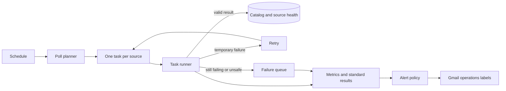

# Pipeline reliability and alerting plan

## Goal

Make failures across catalog ingestion and notification delivery visible, recoverable, and actionable without turning normal transient errors into operator noise. The system should continue processing unaffected work when a single source, link, or delivery provider fails.

## Plain-language terms

- **Failure queue (DLQ):** a holding queue for work that still failed after its allowed retries. It keeps the work available for investigation and safe replay.
- **Source health:** the saved record of whether a job source is current and working, including when it last succeeded and why it last failed.
- **Retry:** automatically try a temporary failure again after a controlled wait.

## Design principles

- **Keep work small and isolated.** A broken employer board must not stall the catalog.
- **Recover before escalating.** Retry temporary failures; alert only when a condition remains actionable.
- **Make state durable.** Logs explain an incident, but persisted health state answers whether a source is currently healthy.
- **Prefer a clear signal over a high volume of email.** One alert should summarize an incident and its current recovery state.

## Current starting point and gap

Today EventBridge Scheduler starts the poll about every five minutes. One Lambda invocation asks each configured source for listings, validates new application links, writes roles to DynamoDB, and then sends alerts for newly discovered matching roles. The link check uses `HEAD` first and a small `GET` fallback when a career site does not support `HEAD`.

This is a good small-catalog starting point, but a source fetch or parse error is currently added to the poll report and logged while the overall Lambda can still finish successfully. That means the Scheduler failure queue only sees failures to invoke Lambda; it does not see a failed Greenhouse, Ashby, Lever, GitHub, link-validation, or notification step. The plan closes that visibility gap.

## Target flow

The existing Scheduler DLQ remains useful for failed schedule-to-Lambda delivery. The target design adds application-level failure queues and health signals so a source fetch, parser, catalog write, or notification failure is not mistaken for a successful poll simply because the Lambda invocation completed.

For a small source list, the poll can continue to run in one Lambda while emitting a durable success/failure record per source. When sources become numerous, the planner creates one queue task per board. Each task either commits a complete result, schedules a retry, or moves to the failure queue; it never silently disappears.

Each task contains only the source ID, provider, board token/name, scheduled time, and retry count—never a job response or user data. A successful task writes both the complete source snapshot and its health record. A failed task preserves the previous catalog state, so a provider outage cannot make existing roles disappear.

## Failure domains and handling

| Domain | Primary response | Escalate when |
| --- | --- | --- |
| Scheduler and task execution | Managed retry; retain unprocessed work | The pipeline has no successful run within its freshness target |
| Source fetch and provider outage | Retry each source with increasing waits | Retries exhaust or a source becomes stale |
| Parser or upstream data-format change | Quarantine the source output | A previously healthy source fails repeatedly or returns an implausible result |
| Quality and official-link checks | Withhold or quarantine the affected role | The error rate indicates broad source degradation |
| Catalog persistence | Retry the write without duplicating jobs | Data cannot be safely committed |
| Push, email, and receipt handling | Retry delivery independently of ingestion | Delivery failure persists or affects many users |

Each result carries a run ID, stage, source/job identifier where relevant, failure category, retry count, and a safe diagnostic summary. Do not put applicant data, credentials, or complete third-party responses in alerts.

### Source-fetch decisions

| Result | Automatic action | Catalog effect |
| --- | --- | --- |
| Timeout, HTTP 429, or HTTP 5xx | Retry that board with increasing waits | Keep the last successful roles open |
| HTTP 404/401 or invalid provider JSON | Quarantine the board and send a prompt alert | Keep the last successful roles open |
| Valid response with unexpected zero roles | Hold the result for review and alert | Do not close roles |
| Valid response with changed content | Validate and reconcile the complete snapshot | Add/update/close roles only after checks pass |
| Individual application link fails | Withhold or quarantine that role | Do not fail the entire board unless failures become widespread |

Source retries end in the failure queue after the configured limit. Notification retries use a separate delivery queue, so a push-provider outage never causes the source to be fetched again or duplicates catalog records.

## Health model and alerts

Persist one health record per source and provider: last successful fetch, freshness target, latency, row count, response/content hash, most recent failure, and current incident state. Publish the same information as metrics for dashboards and alarms.

The record should distinguish **no change** from **could not check**. A `304 Not Modified` or unchanged content hash is healthy; a timeout, HTTP 429/5xx response, malformed JSON, unexpected empty result, or failed catalog write is not. This distinction prevents a quiet but stale board from looking healthy.

| Severity | Example | Delivery expectation |
| --- | --- | --- |
| Immediate | DLQ message, catalog unavailable, sustained delivery outage | Page/email immediately; keep in Inbox |
| Prompt | Repeated board failure, stale source, unexpected empty board result | Send one incident alert and reminders only while unresolved |
| Digest | Isolated invalid link or one rejected row | Group into a scheduled operational summary |

Route mail through a stable operations sender. Gmail labels should separate `InternNotifs/Operations`, `Scrape`, `Delivery`, and `Infrastructure`; new high-severity messages should remain in the Inbox until their signal quality is demonstrated.

## Recovery and operations

Operators need three safe controls: replay an individual failed work item, temporarily quarantine a source, and acknowledge or resolve an incident. Every alert should state the user impact, automatic recovery already attempted, last known good state, and the next safe action.

Runbooks should cover provider outage, unexpected data-format changes, unexpected zero-result boards, storage outage, and push/email degradation. Exercise failure-queue replay and alert delivery periodically so recovery is tested rather than assumed.

## Rollout

1. Add standard result records and saved source health to the existing poller.
2. Add metrics, dashboards, and Gmail-routed alarms while preserving the current scheduler DLQ.
3. Move provider/source work to separate retryable queue tasks as source count grows.
4. Add replay tools, incident state, and regular recovery tests.

Success means no silent stale source, no lost exhausted work, no alert storm from transient failures, and a clear operator path from alert to recovery.
