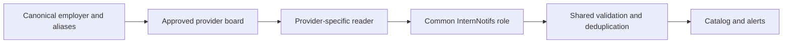

# Future job-board provider expansion plan

## Goal

Extend direct employer coverage after Greenhouse without weakening the catalog's trust model. Every provider must supply jobs from a reviewed employer board, map to the common role shape, and use the same validation, deduplication, source-health, and notification rules.

## Shared source model



An employer name is never an API query. The owner supplies an employer and official careers page; a reviewed source record supplies the provider and provider board ID. Alias matching happens before fetching and only through explicit stored aliases. Unknown or ambiguous input produces no provider request.

Every reader receives only a stored provider and board ID, uses a fixed allowlisted provider host, encodes the ID as one URL path segment, and records a complete successful snapshot. A provider failure preserves the last successful catalog state.

## Provider order and access model

| Provider | Provider board ID | Direct job read | Plan |
| --- | --- | --- | --- |
| Lever | Site/account name | `GET https://api.lever.co/v0/postings/{site}?mode=json` | Already active; use as the reference implementation |
| Ashby | Job-board name | `GET https://api.ashbyhq.com/posting-api/job-board/{name}?includeCompensation=true` | Next public-API candidate after Greenhouse |
| SmartRecruiters | Company identifier | `GET https://api.smartrecruiters.com/v1/companies/{id}/postings` | Only with authorized API-key access |
| Workday, iCIMS, SAP SuccessFactors, and similar | Employer-specific | Varies by employer | Defer until a stable, permitted adapter is verified |
| Aggregators such as LinkedIn and Indeed | N/A | N/A | Never use as a production source or final application destination |

Official references: [Lever Postings API](https://help.lever.co/hc/en-us/articles/20087346449437-Lever-career-site-options), [Ashby Job Postings API](https://developers.ashbyhq.com/docs/public-job-posting-api), and [SmartRecruiters Posting API](https://developers.smartrecruiters.com/docs/posting-api).

## Ashby: next direct-reader candidate

Ashby reads public jobs from:

```text
GET https://api.ashbyhq.com/posting-api/job-board/{job_board_name}?includeCompensation=true
```

The owner verifies `job_board_name` from the employer's official careers page, commonly the final path component of `https://jobs.ashbyhq.com/{job_board_name}`. Do not derive it from the employer name.

Retain only jobs where `isListed` is `true`. Map `title`, `location`, `secondaryLocations`, `descriptionPlain`, `department`, `team`, `publishedAt`, `employmentType`, `workplaceType`, `applyUrl`, `jobUrl`, and disclosed compensation. Use `ashby-{job_board_name}` as the source ID and normalized `applyUrl` as the board-specific role key when no distinct posting ID is present.

During admission, require returned `jobUrl` and `applyUrl` values to match the reviewed Ashby board path or an explicitly approved employer application host. Later fetches use the same queued cadence, bounded concurrency, content-hash/ETag comparison, quiet baseline, link validation, two-snapshot closure rule, and error handling defined for Greenhouse.

## Admission standard for every future provider

1. Confirm the employer through its official careers page and record its canonical identity, aliases, provider board ID, and expected application hosts.
2. Read the provider's documented public endpoint or obtain explicit authorization if the provider requires a key.
3. Add fixtures from representative responses and run the board in shadow mode.
4. Verify employer identity, technical-internship quality, application-link validity, rate-limit behavior, and complete-snapshot behavior.
5. Promote only after the source is stable and the shared reliability system can retry, quarantine, alert, and replay it safely.

Open-source discovery tools and unified wrappers can help find candidate boards, but they never supply production roles. Production data comes from the employer's direct provider endpoint.

## Stop conditions

Do not add a provider when it requires scraping a login-protected page, bypassing a CAPTCHA, guessing an employer identifier, using an aggregator as the source of truth, or accepting unreviewed third-party data. A provider needing credentials stays `requires authorization` until an employer grants that access.

Success means each expansion adds a small, verifiable class of employer sources without making the rest of the catalog less accurate, less private, or harder to operate.
